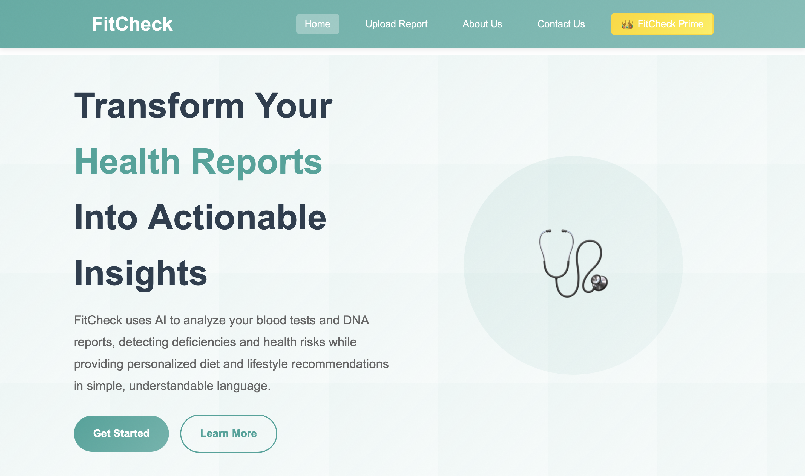
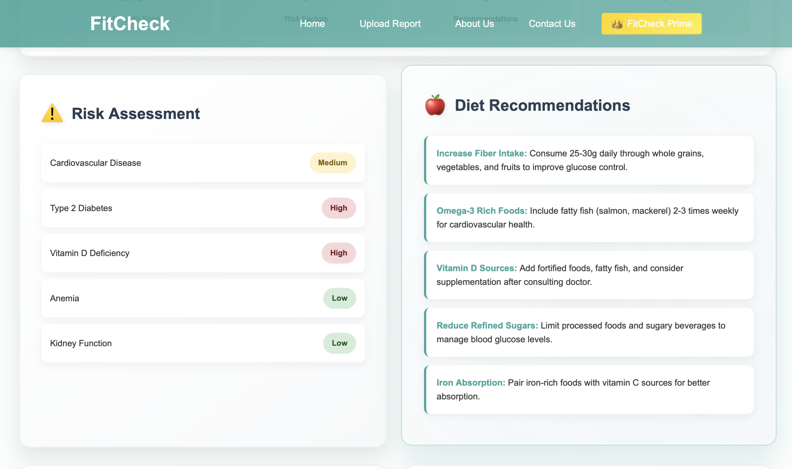

# FitCheck - Smart Health & Fitness Analyzer 🩺

## 📌 Overview
**FitCheck** is an AI/ML-based Health & Fitness Report Analyzer developed for the **Smart India Hackathon 2025** by **Team VORTEX**. The platform bridges the gap between medical professionals and patients by transforming complex, technical health reports into clear, actionable, and easy-to-understand insights[cite: 6, 7]. 

## ✨ Key Features
* **Multi-Report AI Analysis:** Capable of analyzing Blood Tests, DNA & Genetic Testing, Cardiac Health Screening, and Comprehensive Health Panels.
* **Disease Prediction & Tracking:** Detects deficiencies and predicts risks for conditions such as anemia, diabetes, and heart disease[cite: 7].
* **Personalized Recommendations:** Generates customized diet and lifestyle suggestions based on the user's specific health profile[cite: 6, 7].
* **Doctor Alert System:** Automatically triggers high-priority alerts for critical values that require immediate medical attention[cite: 6].
* **Location-Based Healthcare:** Automatically detects the user's location to recommend and provide directions to nearby hospitals and healthcare providers[cite: 6].
* **FitCheck Prime:** Features premium subscription tiers (Silver, Gold, Platinum) with family sharing and advanced predictive analytics[cite: 6].

## 🛠️ Technical Approach
* **Frontend:** Built using HTML, CSS, and JavaScript for a responsive and intuitive user interface[cite: 7].
* **Backend:** Powered by Python utilizing Flask/FastAPI for robust API handling and model integration[cite: 7].
* **Machine Learning:** Implemented using Scikit-learn[cite: 7].
* **Algorithms Used:** Logistic Regression, Random Forest, and XGBoost[cite: 7].
* **Datasets:** Trained on validated data from UCI and Kaggle (Diabetes, Heart, CBC datasets)[cite: 7].

## 🚀 Feasibility & Impact
* **Social Impact:** Improves health awareness and serves as a preventive healthcare tool for patients and fitness enthusiasts[cite: 7].
* **Economic Benefit:** Reduces unnecessary doctor visits and healthcare costs through early detection[cite: 7].
* **Data Security:** Implements encryption and secure storage, ensuring that all health data remains completely confidential[cite: 6, 7].

## 👨‍💻 About Me
I am Arpit Kumar, a B.Tech Computer Science and Engineering student passionate about data science, machine learning, and building software that creates a positive social impact. 

Let's connect: www.linkedin.com/in/arpit-kumar-44bb8a29b
